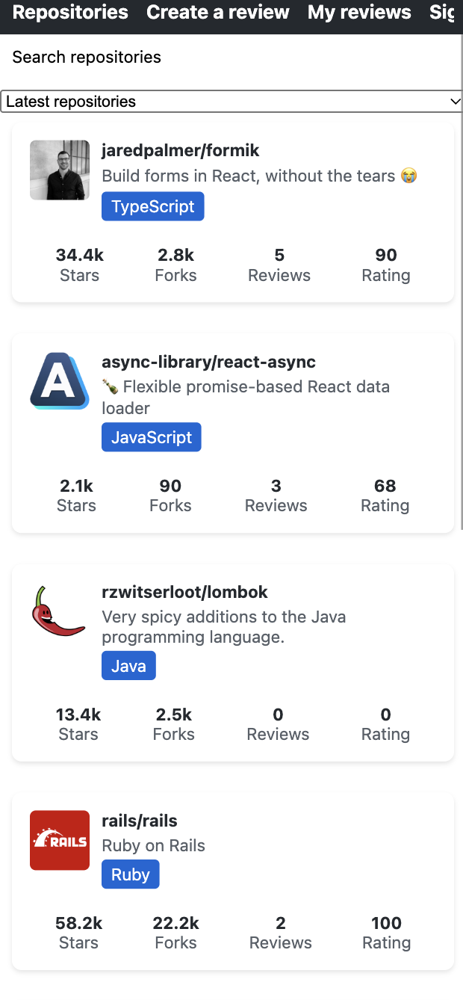
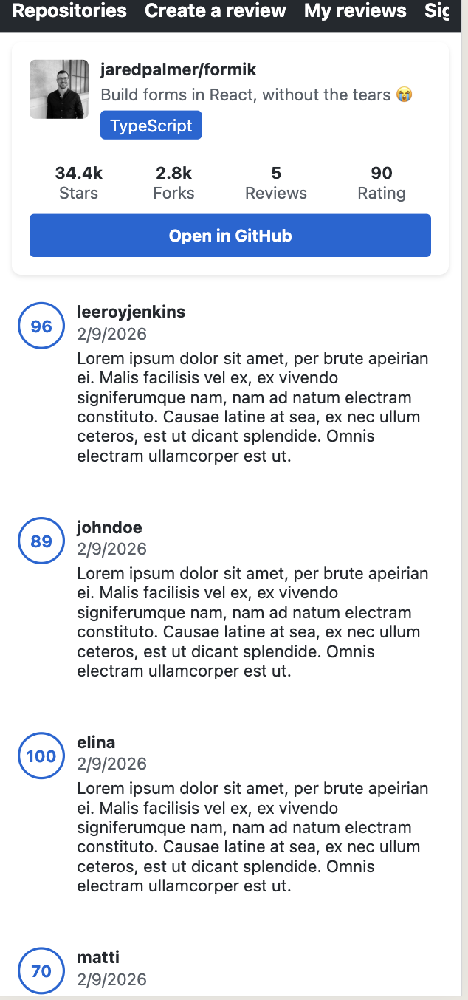
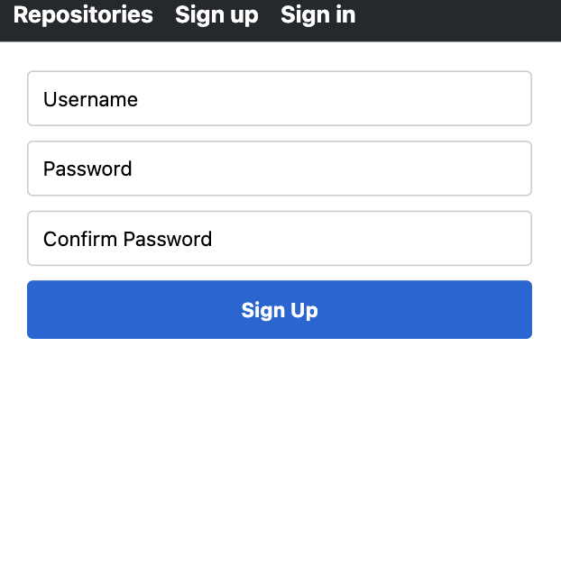
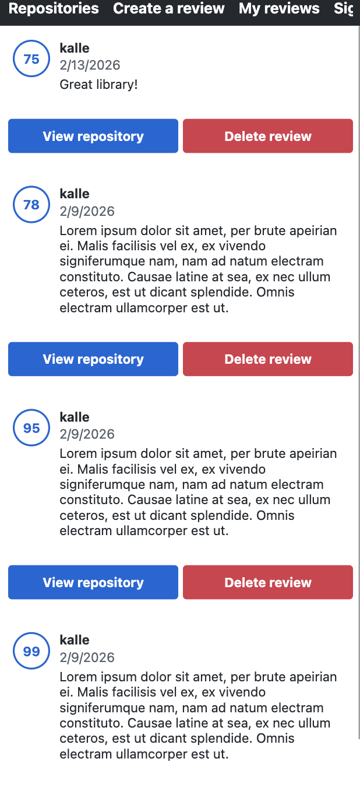

# 🏗 Rate Repository App – React Native + Apollo GraphQL


A **junior-friendly mobile application** that lists GitHub repositories, supports authentication, and demonstrates **clean state management** with **Apollo Client**.  
The app consumes a local GraphQL API (`rate-repository-api`) to fetch data, manage reviews, and securely store access tokens.

🌐 [**API Repo**](https://github.com/Nyukaa/ReactNative/tree/main/rate-repository-api) 💻 [**GitHub**](https://github.com/Nyukaa/ReactNative/tree/main/rate-repository-app) 👩‍💻 [**Author**](https://github.com/Nyukaa/)

---

## 🚀 Overview

Rate Repository App allows users to:

- Browse repositories with detailed stats (stars, forks, reviews, rating)
- View a single repository with paginated reviews
- Create reviews with validated forms
- Sign in and sign up with JWT-based authentication
- Sort repositories by latest, highest, or lowest rating

The app demonstrates **mobile app architecture**, Apollo Client integration, and **auth-aware data fetching**.

---

## 📸 Screenshots / App Preview

| Repository List                                                       | Single Repository                                                          | Sign Up                                                         | My Reviews                                                        |
| --------------------------------------------------------------------- | -------------------------------------------------------------------------- | --------------------------------------------------------------- | ----------------------------------------------------------------- |
|  |  |  |  |

## 🧰 Technologies Used

**Mobile / Frontend**

- React Native (Expo)
- React Router Native
- Apollo Client, GraphQL
- Formik + Yup
- AsyncStorage for token persistence

**Backend**

- Node.js + Koa
- Apollo Server (GraphQL)
- SQLite with Objection.js + Knex
- JWT authentication
- Cursor-based pagination

---

## 🧠 Engineering Decisions

### 1. Authentication & Token Management

- Sign-in/sign-up forms store JWT in AsyncStorage
- Apollo Client automatically attaches Authorization header
- App bar and navigation respond dynamically to auth state

### 2. Data Loading & Pagination

- Repositories and reviews fetched via GraphQL queries
- Cursor-based pagination enables infinite scrolling
- Sorting by latest, highest, or lowest rating using query variables

### 3. Clean UI & State Separation

- Repository list and items split into reusable components
- Local UI state handled with React hooks
- Apollo cache ensures efficient data updates

### 4. Form Validation

- Formik handles form state and submission
- Yup validates input to prevent invalid entries
- Rating and text inputs validated for review creation

---

## ✨ Key Features

- Repository list with detailed stats
- Single repository view with reviews
- Create review form with validation
- Sign in / Sign up forms with JWT token storage
- Sorting & filtering repositories
- Auth-aware navigation and app bar
- Cursor-based pagination for smooth scrolling

---

## 🧪 Testing

Unit and integration tests for key components using React Native Testing Library ensure that repository lists render correctly and that sign-in forms submit valid credentials, focusing on pure components without directly testing Apollo Client or AsyncStorage.

---

## 🎓 What This Project Demonstrates

- Expo-based React Native structure with routing
- Apollo Client integration and GraphQL queries/mutations
- JWT token persistence and auth-aware client configuration
- Clean UI composition and theming
- Cursor-based pagination and infinite scrolling
- Practical testing of React Native components

---

⭐ This project reflects a focus on **mobile-first design, type-safe data handling, and clean architecture for junior-friendly learning**.

<!---

## ⚙️ Operations (Backend Highlights)

- Queries:
  - `repositories(first, after, orderBy, orderDirection, searchKeyword, ownerName)`
  - `repository(id)`
  - `users(first, after)`
  - `me`
- Mutations:
  - `authenticate(credentials)`
  - `createUser(user)`
  - `createReview(review)`
  - `deleteReview(id)`

## 🚀 Quick Start

### Backend (GraphQL API)

- **Location**: `/Users/s2500281/Documents/ReactNative/rate-repository-api`
- **Setup**:
  ```
  npm install
  cp .env.template .env
  # set GITHUB_CLIENT_ID, GITHUB_CLIENT_SECRET, JWT_SECRET
  npm run build
  npm run seed:run
  npm start
  ```
- **GraphQL**: http://localhost:4000
- **REST**: http://localhost:5000/api

### Mobile App (Expo)

- **Location**: `/Users/s2500281/Documents/ReactNative/rate-repository-app`
- **Configure APOLLO_URI env**:
  - iOS simulator / Android emulator: `APOLLO_URI=http://localhost:4000`
  - Android emulator alt: `APOLLO_URI=http://10.0.2.2:4000`
  - Physical device: `APOLLO_URI=http://<your-ip>:4000`
- **Start**:
  ```
  APOLLO_URI=http://localhost:4000 npm run start
  ```
  -->
